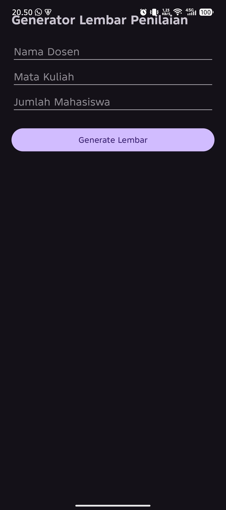
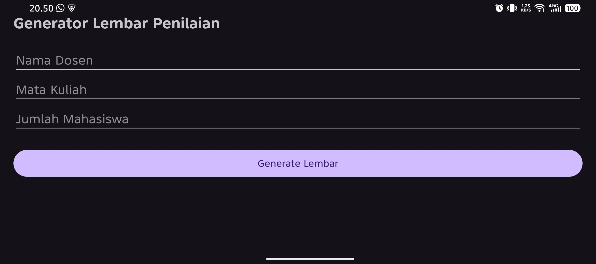
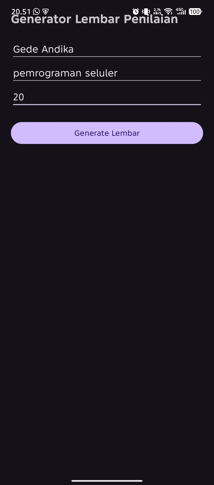
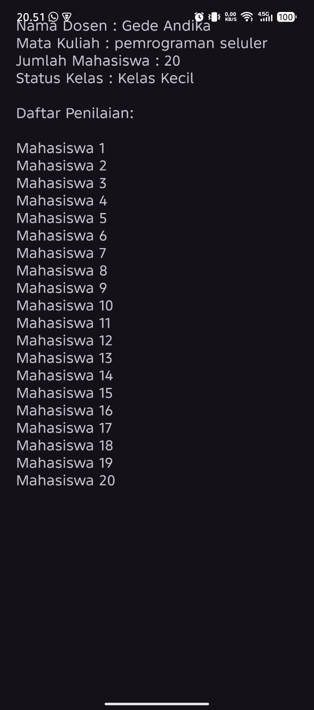

# UTS Pemrograman Seluler - Aplikasi Generator Lembar Penilaian

## Identitas Mahasiswa
- Nama Lengkap: Gede Andika
- NIM: 42430022
- Program Studi: Teknik Informatika

## Deskripsi Aplikasi
Aplikasi ini dibuat untuk memenuhi UTS Pemrograman Seluler.

Fitur:
- Layout responsive portrait dan landscape
- Intent data passing
- If Else status kelas
- For Loop daftar mahasiswa

## Screenshot Aplikasi

### Halaman Login

### Panel Generator

